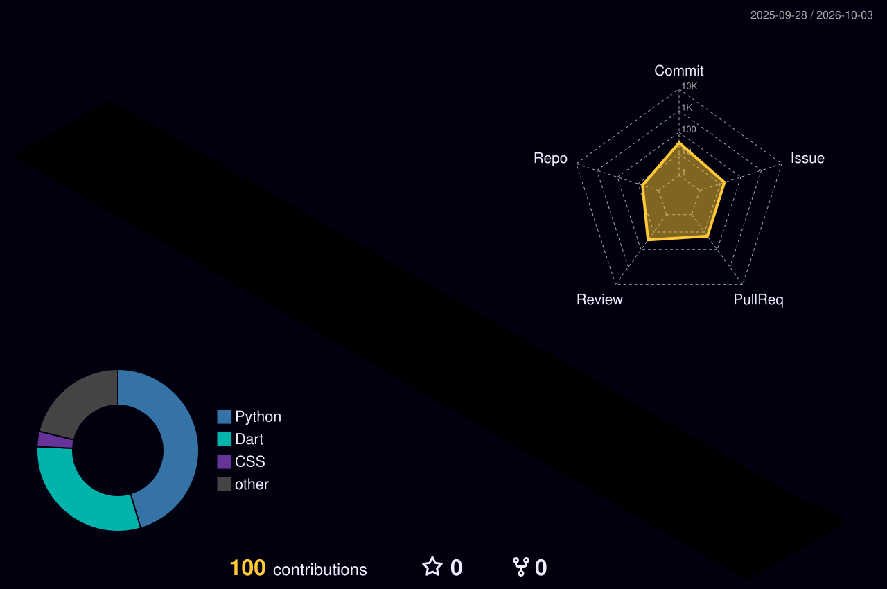

  🚀 <b>어제보다 한 줄 더 나은 코드를.</b>  
  안녕하세요, <b>빠르게 배우고 더 나은 것을 만드는 개발자 정재영</b>입니다. 
  처음 보는 기술도 필요하면 직접 배워서, 끝까지 연결해 냅니다. 
  요즘은 <b>FastAPI · Flutter</b>로 <b>오또(OddO)</b>를 개발하면서, <b>Spring Boot · JPA</b>도 깊게 파고 있어요.  
  <b>꾸준히 쌓아가는 개발자</b>가 되겠습니다. ✍️

 

## 🙋 About Me

- 🖥️ 백엔드(Spring, FastAPI)를 중심으로 프론트엔드(Flutter, HTML/CSS)까지, 하나의 서비스를 처음부터 끝까지 만들어 보고 있어요.
- 🎙️ Mediapipe, librosa로 영상·음성 데이터를 다루며 AI 기능을 서비스에 녹이는 일에 관심이 많아요.
- 🌱 요즘은 **Spring Boot · JPA · JWT 인증**을 깊게 공부하고 있어요.

 

## 🛠️ Tech Stack

| 구분 | 많이 해봤어요 | 해본 적 있어요 |
|:---:|:---|:---|
| **Language** |     |    |
| **Backend** |   |  |
| **Frontend** |  |  |
| **Database** |   |  |
| **AI / Data** |   |     |
| **Tools** |    |     |

 

## 🎓 Education

- **Hongik University (Sejong) – 과학기술대학 소프트웨어융합학과**
  *(2023 – 재학 중)*

 

## 🏅 Experience

- **홍익대학교 메타버스 융합 SW 아카데미 6기** *(2026 – 교육 중)*
  – 웹 개발 전반 실습 중심 교육, 백엔드 설계 및 개인·팀 프로젝트 수행

 

## 💼 Projects

| Period | Type | Project | Description | Awards |
|:---:|:---:|:---:|---|:---:|
| 26.04 ~ 진행 중 | ⭐ Core | [오또 (OddO)](https://github.com/Team-SaGoMugChi) | 멀티모달 실시간 감정 분석 기반 AI 감정 영상 일기 서비스 4인 팀 · 멀티모달 감정 분석 및 대화형 일기 구현 담당 | 🏅 |
| 25.09 - 25.12 | 🌐 Web | [Campus Link](https://youngjae734.github.io/jaeyoungfolio/assets/Campus%20Link.pdf) | Oracle · PHP 기반 캠퍼스 활동·일정·공간 예약 통합 관리 웹 서비스 | |
| 25.10 - 25.11 | 📊 Data | [LifeLog Productivity Predictor](https://youngjae734.github.io/jaeyoungfolio/assets/LifeLog%20Productivity%20Predictor.pdf) | 수면·스트레스·번아웃 등 라이프로그 데이터로 생산성을 예측하는 ML 분석 | |

 

## 🏆 Awards

| Date | Award / Recognition | Project |
|:---:|---|:---:|
| 2026.06 | 대한전자공학회 하계학술대회 🏅 **우수학생논문상** | 오또 |
| 2026.03 | 한이음 공모전 🏅 **입선** | 오또 |

 

## 🔥 GitHub 활동

<picture>
  <source media="(prefers-color-scheme: dark)" srcset="./profile-3d-contrib/profile-night-rainbow.svg" />
  <source media="(prefers-color-scheme: light)" srcset="./profile-3d-contrib/profile-green-animate.svg" />
  
</picture>

  
  

  

 

## 📫 Contact

  
  
  

